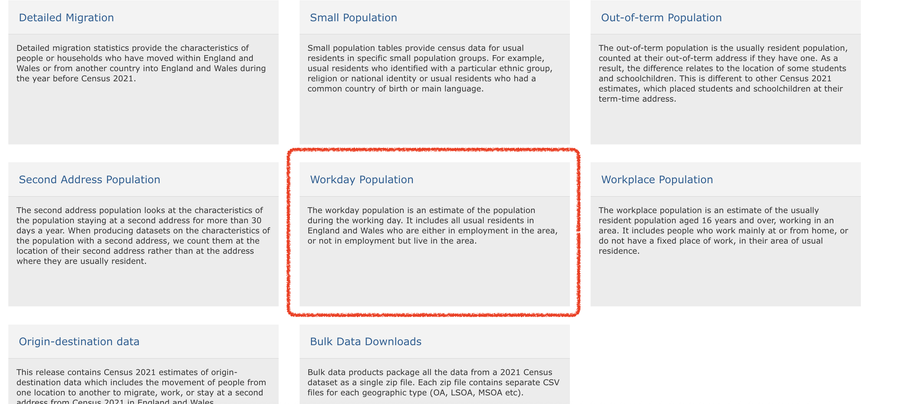

# Thematic maps in R

## Introduction

Last week we showed you fairly quickly how to create maps by understanding how data may have spatial elements, and how that can be linked to geometries. 

This week we will get to know how to think about thematic maps, and how to apply your learning to creating your own maps of this variety. In our lecture videos this week we discuss in detail issues with choropleth maps. So the focus of today's lab is going to be around thematic maps and some of the choices we discussed. 

We will also introduce faceting and **small multiples**, which is a format for comparing the geographical distribution of different social phenomena. For this session we will be using the spatial object that you created last week and complement it with additional information from the census. So first of all you will have to rerun the code you used to create the *manchester_lsoa* `sf` object. Apart from doing so, you want to start your session loading the libraries you know for sure you will need:

- `dplyr`
- `janitor`
- `readr`
- `sf`
- `shinyjs`
- `tmap`

```{r, warnings=FALSE, message=FALSE, echo=FALSE}
library(readr)
library(sf)
library(janitor)
library(tmap)
library(dplyr)
```

You may not remember all of what you did to generate that file so let's not waste time and just cut and paste from below (but try to remember what each of the lines of code is doing and if you are not clear look at the notes from last week). Imagine you had to do all of this again by pointing and clicking in a graphical user interface rather than just sending the code to the console! As you will see time and time again, code in the end is a much more efficient way of talking to a computer.

```{r}
crimes <- read_csv("data/2019-06-greater-manchester-street.csv")
```

```{r, eval=FALSE}
#The following assumes you have a subdirectory called BoundaryData in your data folder, if not then you will need to change to the 'pathfile' where you store your LSOA shapefile. 
shp_name <- "data/BoundaryData/england_lsoa_2021.shp"
manchester_lsoa <- st_read(shp_name)

#Alternatively, you can download the 'LSOA shapefile' from where we saved the data. 
#Important! note that I store it in on my 'Data' folder You HAVE TO change that if needed.
download.file("https://www.dropbox.com/s/h5c1okn4m6t3rqe/BoundaryData.zip?dl=1" , 
              destfile="data/BoundaryData.zip", # change to your local directory
              mode = "wb") # write binary data

#Important! note that I extract file to the data/BoundaryData folder. You HAVE TO change exdir (the directory to extract files to)
unzip("data/BoundaryData.zip", exdir = "data")
manchester_lsoa <- st_read("data/BoundaryData/england_lsoa_2021.shp")
```

Once you import the data, let's count the number of crimes in each LSOA units like what we did in the week 2.

```{r, eval=FALSE, message=FALSE}
#count the number of crimes in each LSOA
crimes_per_lsoa <- crimes %>%
  clean_names() %>% 
  select(lsoa_code) %>%
  group_by(lsoa_code) %>%
  summarise(count=n())
#merge the crime count with the LSOA file
manchester_crime_lsoa <- left_join(manchester_lsoa, crimes_per_lsoa, by = c("lsoa21cd"="lsoa_code"))

#Any LSOA units with no crime counted (E01005248 and E01005278) are treated as NA, so replace this as 0
#However, this process you need to carefully proceed. In some context, you could consider 'unknown' or 'missing' not 0
manchester_crime_lsoa$count[is.na(manchester_crime_lsoa$count)] <- 0
```

You may not want to have to go through this process all the time. One thing you could do is to save the *manchester_lsoa* object as a physical file in your machine. You can use the `st_write()` function from the `sf` package to do this. If we want to write into a shapefile format we would do as shown below:

```{r, eval=FALSE}
st_write(manchester_crime_lsoa, "data/BoundaryData/manchester_crime_lsoa.shp")
```

Notice how four files have appeared in your working directory, in your "BoundaryData"" subdirectory or whatever you called it. Remember what we said last week about shapefiles, there are a collection of files that need to be kept together.

If you wanted to bring this shapefile back into R at any future point, you would only need to use the `st_read()` function.

```{r}
manchester_crime_lsoa <- st_read("data/BoundaryData/manchester_crime_lsoa.shp")
```

### Activity 1: Spot the difference

Before we carry on, can you tell what is different between *manchester_lsoa.shp* and *manchester_crime_lsoa.shp* that you now have saved for working with? Discuss in your groups. 

## Creating thematic maps

Today we are going to introduce the `tmap` package. This package was developed to easily produce thematic maps. It is inspired by the `ggplot2` package and the layered grammar of graphics. It was written by Martjin Tennekes a Dutch data scientist. There are a number of [vignettes in the CRAN repository](https://cran.r-project.org/web/packages/tmap/index.html) and the [GitHub repo for this package](https://github.com/mtennekes/tmap) that you can explore. GitHub is a collaborative website used by software developers and data scientist, also contains a useful *readme* section with additional resources to familiarise yourself with this package. Each map can be plotted as a static map (*plot mode*) and shown interactively (*view mode*) as we briefly saw last week. We will start by focusing on static maps.

Every time you use this package you will need a line of code that specifies the spatial object you will be using. Although originally developed to handle `sp` objects only, it now also has support for `sf` objects. For specifying the spatial object we use the `tm_shape()` function and inside we specify the name of the spatial object we are using. On its own, this will do nothing apparent. No map will be created. We need to add additional functions to specify what we are doing with that spatial object. If you try to run this line on its own, you'll get an error telling you you must "Error: no layer elements defined after tm_shape". 

```{r, eval=FALSE}
library(tmap)
tm_shape(manchester_crime_lsoa)
```

The main plotting method consists of elements that we can add. The first element is the `tm_shape()` function specifying the spatial object, and then we can add a series of elements specifying layers in the visualisation. They can include polygons, symbols, polylines, raster, and text labels as base layers. We will add a polygon using `tm_polygon()`. As noted, with `tmap` you can produce both static and interactive maps. The interactive maps rely on `leaflet`. You can control whether the map is static or interactive with the `tmap_mode()` function. If you want a static map you pass `plot` as an argument, if you want an interactive map you pass `view` as an argument. Let's create a static map first. 

```{r}
tmap_mode("plot")
tm_shape(manchester_crime_lsoa) + 
  tm_polygons()
```

Given that we are not passing any additional arguments all we are getting is a map with the shape of the geographies that we are representing, the census LSOAs for Manchester city. We can, however, ask R to produce a choropleth map by mapping the values of a variable in our data table using colour.  In tmap we need to denote our variables between quotes. The first argument we pass then would be the name of the variable we want to visualise. If you remember we have a count for crimes ("count"), so let's visualise that by creating a thematic map.

```{r}
tm_shape(manchester_crime_lsoa) + 
  tm_polygons("count")
```

We have been using `tm_polygons()` but we can also add the elements of a polygon map using different functions that break down what we represent here. In the map above you see the polygons have a dual representation, the borders are represented by lines and the colour is mapped to the intensity of the quantitative variable we are representing. With darker colours representing more of the variable, the areas with more crimes. Instead of using `tm_polygon()` we can use the related functions `tm_fill()`, for the colour inside the polygons, and `tm_borders()`, for the aesthetics representing the border of the polygons. Say we find the borders distracting and we want to set them to be transparent. In that case we could just use `tm_fill()`.

```{r}
tm_shape(manchester_crime_lsoa) + 
  tm_fill("count")
```

As you can see here, the look is a bit cleaner. We don't need to get rid of the borders completely. Perhaps we want to make them a bit more translucent. We could do that by adding the border element but making the drawing of the borders less pronounced. 

```{r}
tm_shape(manchester_crime_lsoa) + 
  tm_fill("count") +
  tm_borders(col_alpha = 0.1)
```

The alpha parameter that we are inserting within `tm_borders()` controls the transparency of the borders, we can go from 0 (totally transparent) to 1 (not transparent). You can play around with this value and see the results.

Notice in the last few maps we did not have to specify whether we wanted the map to be static or interactive. When you use `tmap`, R will remember the mode you want to use. So once you specify `tmap_mode("plot")`, all the subsequent maps will be static. It is only when you want to change this behaviour that you would need another `tmap_mode` call.

Notice as well that the legend in this map is (a) not very informative and (b) located in a place that is less than optimal, since it covers part of the map. We can add a title within the `tm_title()` to clarify what count is and we can use the `tm_legend()` function to control the appearance of the legend. This later function `tm_legend()` allows you to think about many of the more general cosmetics of the map.

```{r}
tm_shape(manchester_crime_lsoa) + 
  tm_fill("count", 
          fill.legend = tm_legend(title = "Crime counts", position = c("right", "bottom"), title.size = 0.8)) +
  tm_borders(col_alpha = 0.1) +
  tm_title(text = "Crime in Manchester City, June/2019", size = 0.7 )
```

We can also change the cstyle of the maps by making them more friendly to colour blind people, or to see what they will look like printed by using the "bw" theme (black and white). 

```{r}

current_style <- tmap_style("bw")

```

See how the map changes.

```{r}

tm_shape(manchester_crime_lsoa) + 
  tm_fill("count", 
          fill.legend = tm_legend(title = "Crime counts", position = c("right", "bottom"), title.size = 0.8)) +
  tm_borders(col_alpha = 0.1) +
  tm_title(text = "Crime in Manchester City, June/2019", size = 0.7 )


```

Let's go back to the default for now ("white"):

```{r}

current_style <- tmap_style("white")

```


## Classification systems for thematic maps

In thematic mapping, you have to make some key decisions, the most important one being how to display your data. When mapping a quantitative variable, we have to "bin" this variable into groups. For example in the map we made below, the default binning applied was to display LSOAs grouped into those with 1 -200, 201-400, 401-600 and 601-800 crimes. But why these? How were these groupings decided upon?

The quantitative information, being directly measured (e.g. total population) or derived (e.g. population density), is usually classified before its symbolization in a thematic map. Theoretically, accurate classes that best reflect the distributional character of the data set can be calculated.

**The equal interval** (or equal step) classification method divides the range of attribute values into equally sized classes. What this means is that the values are divided into equal groups. This approach is best for continuous data. 

**The quantile map** bin the same count of features into each of its classes. This classification method places equal numbers of observations into each class. This method is best for data that is evenly distributed across its range. 

**The natural breaks (or Jenks)** classification method utilizes an algorithm to group values in classes that are separated by distinct break points. It is an optimisation method which takes an iterative approach to its groupings to achieve least variation within each class. This method is best used with data that is unevenly distributed but not skewed toward either end of the distribution. 

**The standard deviation** map uses the standard deviation (standardised measure of observations' deviation from the mean) to bin the observations into classes. This classification method forms each class by adding and subtracting the standard deviation from the mean of the dataset. It is best suited to be used with data that conforms to a normal distribution. 

The above should be familiar from your reading, but if you would like another angle I recommend a browse of [this guide](https://gisgeography.com/choropleth-maps-data-classification/) which has some nice visualisations. 

### Activity 2: Comparing classifications 

For comparing the effects of using different methods we can use small multiples. Small multiples is simply a way of reproducing side by sides similar maps for comparative purposes. To be more precise small multiples are *sets of charts of the same type, with the same scale, presented together at a small size and with minimal detail, usually in a grid of some kind*. The term was at least popularized by Edward Tufte, appearing first in his *Visual Display of Quantitative Information* in 1983.

There are different ways of creating small multiples with `tmap` as you could see in the vignettes for the package, some of which are quicker but a bit more restricted. Here we are going to use `tmap_arrange()`. With `tmap_arrange()` first we need to create the maps we want and then we arrange them together.

Let's make four maps, each one using a different classification method: Equal interval, Quantile, Natural breaks (Jenks), and Standard Deviation. 

For each map, instead of visualising them one by one, just assign them to a new object. Let's call them *map1*, *map2*, *map3* and *map4*. 

So let's make *map1*. This will create a thematic map using equal intervals:

```{r}

map1 <- tm_shape(manchester_crime_lsoa) +  # Specify spatial object
  tm_fill("count", # Define fill variable
          fill.scale = tm_scale_intervals(style="equal"), # Define classification
          fill.legend = tm_legend(title = "Equal",        # Legend title
                                  position = c("right", "bottom"), # Legend position
                                  text.size = 0.5, # Legend text size
                                  title.size = 0.7))    #Legend title size

```

Now create *map2*, with the jenks method often preferred by geographers:

```{r}
map2 <- tm_shape(manchester_crime_lsoa) +  # Specify spatial object
  tm_fill("count", 
          fill.scale = tm_scale_intervals(style="jenks"), 
          fill.legend = tm_legend(title = "Jenks", 
                                  position = c("right", "bottom"), 
                                  text.size = 0.5, 
                                  title.size = 0.7))   
```

Now create *map3*, with the quantile method often preferred by epidemiologists:


```{r}

map3 <- tm_shape(manchester_crime_lsoa) +
  tm_fill("count", 
          fill.scale = tm_scale_intervals(style="quantile"), 
          fill.legend = tm_legend(title = "Quantile", 
                                  position = c("right", "bottom"),
                                  text.size = 0.5, 
                                  title.size = 0.7)) 

```

This is neat as you can specify many things, for example the number of groups to split your data into. 

And finally make *map4*, standard deviation map, which maps the values of our variable to distance to the mean value.

```{r}
map4 <- tm_shape(manchester_crime_lsoa) +
  tm_fill("count", 
          fill.scale = tm_scale_intervals(style="sd"), 
          fill.legend = tm_legend(title = "Standard \nDeviation", 
                                  position = c("right", "bottom"),
                                  text.size = 0.5, 
                                  title.size = 0.7)) 

```

Notice that we are not plotting the maps, we are storing them into R objects (map1 to map4). This way they are saved, and you can call them later, which is what we need in order to plot them together using the `tmap_arrange()` function. 

So if you wanted to map just *map3* for example, all you need to do, is call the map3 object. Like so: 

```{r}
map3
```

But now we will plot all 4 maps together, arranged using the `tmap_arrange()` function. Like so: 

```{r, message=FALSE}
#And now we deploy tmap_arrange to plot these maps together
tmap_arrange(map1, map2, map3, map4) 
```

There are some other classification methods built into tmap which you can experiment with if you'd like. Your discrete gradient options are "cat", "fixed", "sd", "equal", "pretty", "quantile", "kmeans", "hclust", "bclust", "fisher", "jenks", "dpih", "headtails", and "log10_pretty". A numeric variable is processed as a categorical variable when using "cat", i.e. each unique value will correspond to a distinct category.

Taken from the help file we can find more information about these, for example the "kmeans" style uses kmeans clustering technique (a form of unsupervised statistical learning) to generate the breaks. The "hclust" style uses hclust to generate the breaks using hierarchical clustering and the "bclust" style uses bclust to generate the breaks using bagged clustering. These approaches are outisde the scope of what we cover, but just keep in mind that there are many different ways to classify your data, and you must think carefully about the choice you make, as it may affect your readers' conclusions from your map. 

## Using graduated symbols

Some of the literature on thematic cartography highlights how counts, like the ones above, are best represented using graduated symbols rather than choropleth maps (using colour, as we did above). So let's try to go for a more appropriate representation. In `tmap` you can use tm_symbols for this. We will also use `tm_borders` to provide some context.

```{r, message=FALSE}
tm_shape(manchester_crime_lsoa) + 
  tm_bubbles("count")
```

First thing you see is that we loose the context (provided by the polygon borders) that we had earlier. The `border.lwd` argument set to NA in the `tm_symbols()` is asking R not to draw a border to the circles. Whereas `tm_borders()` brings back a layer with the borders of the polygons representing the different LSOAs in Manchester city. Notice how I am modifying the transparency of the borders with the `col_alpha` parameter.

```{r}
tm_shape(manchester_crime_lsoa) +                         #use tm_shape function to specify spatial object
  tm_bubbles("count", lwd = NA) +              #use tm_bubbles to add the bubble visualisation, but set the 'border.lwd' parameter to NA, meaning no symbol borders are drawn
  tm_borders(col_alpha = 0.1) +                           #add the LSOA border outlines using tm_borders, but set their transparency using the cl_alpha parameter (0 is totally transparent, 1 is not at all)
  tm_layout(
    legend.position = c("right", "bottom"),
    #use tm_layout to make the legend look nice
    legend.title.size = 0.8,
    legend.text.size = 0.5
  )
```

## Mapping rates rather than counts

In much of our readings we have now seen the importance to map rates rather than counts of things, and that is for the simple reason that population is not equally distributed in space. That means that if we do not account for how many people are somewhere, we end up mapping population size rather than our topic of interest. As always, there is a relevant xkcd for that: 


In specific to crime mapping, there is an ongoing issue of the *denominators dilemma* which has been cropping up in your reading. This is concerned with choosing the most appropriate measure for calculating crime rates. The best measure is one which captures opportunities. You read about some approaches to capturing ambient population for example to estimate risk for on-street crimes. Whatever denominator you choose, you will usually want to make a case as to why that is the best representation of the opportunities for the crime type you're interested in. 

### Activity 3: Getting population data from the census

Last week you learned how to obtain crime data from the police UK website and you also developed the skills to obtain shapefiles with the boundaries for the UK census geographies. Specifically you learnt how to obtain LSOAs boundaries. Then we taught you how to join these data tables using `dplyr`. If you open your *manchester_lsoa* object you will see that at the moment you only have one field in this dataframe providing you with statistical information. However, there is a great deal of additional information that you could add to these data frame. Given that you are using census geographies you could add to it all kind of socio demographic variables available from the census. 

The UK census data is available through a number of portals. One of them is the [nomis data portal](https://www.nomisweb.co.uk/sources/census_2021). This portal allows you to download census data for different geographies and different variables.

You may want to read [this brief tutorial](https://ukdataservice.ac.uk/app/uploads/areaprofilesaccessingdata2023-02-28.pdf) to get a sense for how to obtain the data. We are going to get some data for Manchester city LSOAs. 

Specifically we want to find workday population () and residential population () to be able to use the two different denominators to make comparisons. Do note that the Census data are from 2021, at a time when COVID-19 related restrictions were in place, so the workday population figures may not be representative of a typical year. The next census is not until 2031, but the ONS do publish updated population estimates over time so you may want to explore those for more up to date figures. However, for the purposes of this course, we will be working with the census data. 

So we want to go to the [nomis data portal](https://www.nomisweb.co.uk/sources/census_2021) and select the 2021 census data. Specifically we want residential and workday populations. To download these you have to select two different boxes. First, scroll down to the *Workday Population* box and click on that. 



This should take you to the site [https://www.nomisweb.co.uk/sources/census_2021_wd](https://www.nomisweb.co.uk/sources/census_2021_wd) where you can download workday population data. We want the first one in the list, which is *WD001 - Workday Population by population density*. Click on that and unzip the resulting file. This will open up a list of files where the name contains the unit of analysis at which the data are aggregated. As we are working with LSOAs we want the file 'WD001_lsoa.csv'. Move that file to save it into your data subfolder in your project directory. 

Next go back to the main page and choose the 'Bulk Data Downloads' box. 


This will take you to [https://www.nomisweb.co.uk/sources/census_2021_bulk](https://www.nomisweb.co.uk/sources/census_2021_bulk) where you can download the first file there 'TS001: Number of usual residents in households and communal establishments':


Use `read_csv()` function from the `readr` package to import this data.


```{r importcensus}

census_respop <- read_csv("data/census2021-ts001-lsoa.csv") %>% clean_names()
census_workdaypop <- read_csv("data/WD001_lsoa.csv") %>% clean_names()

```

We can join these together to create a single data frame with the two population measures we want. We can use again the `left_join()` function from the `dplyr` package to do this.

```{r}

census_lsoa_m <- left_join(census_respop %>% select(geography, geography_code, residence_type_total_measures_value), 
                           census_workdaypop %>% select(lower_layer_super_output_areas_code,
                                                        lower_layer_super_output_areas_label, 
                                                        population_density), 
                           by = c("geography_code" = "lower_layer_super_output_areas_code", 
                                  "geography" = "lower_layer_super_output_areas_label")) %>%
  rename(respop = residence_type_total_measures_value,
         wkdpop = population_density)

```

You might want to save this file so you have it readily available for next time. You will be using it again in this week's homework task for example. Make sure to save in your data folder!

```{r, eval = FALSE}

write.csv(census_lsoa_m, file = "data/census_lsoa_manchester.csv", row.names = FALSE)

```


Now that we have the file ready we can link it to our *manchester_lsoa* file using code we learned last week. We use again the `left_join()` function to add to the *manchester_lsoa* dataframe the variables that are present in the *census_lsoa_m*. The first argument in the function is the name of the dataframe to which we want to add fields, the second argument the name of the dataframe from which those fields come, and then you need to specify using "by" the name of the variables on each of these two dataframes that have the id variable that will allow us to ensure that we are linking the information across the same observations.

```{r}
manchester_crime_lsoa <- left_join(manchester_crime_lsoa, census_lsoa_m, by = c("lsoa21cd"="geography_code"))
```

And there you go... Now you have a datafile with quite a few pieces of additional information about LSOAs in Manchester.

The next step is to use this information.

#### Activity 4: Computing crime rates

Ok, so now we have a field that provides us with the number of crimes and two alternative counts of population for each LSOA in Manchester in the same dataframe. We could compute the rate of crime in each using the population counts as our denominator. Let's see how the maps may compare using these different denominators. 

But first we need to create new variables. For this we can use the `mutate()` function from the `dplyr` package. This is a very helpful function to create new variables in a dataframe based on transformations or mathematical operations performed in other variables within the dataframe. In this function, the first argument is the name of the data frame, and then we can pass as arguments all new variables we want to create as well as the instructions as to how we are creating those variables. 

First we want to create a rate using the usual residents, since crime rates are often expressed by 1,000 inhabitants we will multiply the division of the number of crimes by the number of usual residents by 1,000. We will then create another variable, *crimr2*, using the workday population as the denominator. We will store this new variables in our existing *manchester_lsoa* dataset. You can see that below then I specify the name of a new variable *crimr1* and then I tell the function I want that variable to equal (for each case) the division of the values in the variable *count* (number of crimes) by the variable *respop* (number of people residing in the area) and then we multiply the result of this division by 1,000 to obtain a rate expressed in those terms. Then we do likewise for the alternative measure of crime.

```{r}
manchester_crime_lsoa <- manchester_crime_lsoa %>% 
  mutate(crimr1 = (count/respop)*1000, 
         crimr2 = (count/wkdpop)*1000)

```

And now we have two new variables, one for crime rate with residential population as a denominator, and another with workplace population as a denominator. 

### Activity 5: Mapping crime rates

Now that we have our variables for crime rate per population, we can use this to produce our crime maps!

Let's first map crime count, next to residential population, and then the crime rate. We can do this by creating two maps, and then using our trusty `tmap_arrange()` to put them next to one another. 

Let's also use a different palette for each map, that is a different fill colour. To change the colours for the fill of the polygons you can use the palette argument within the `tm_fill()` function. You can explore different palettes running the following code:

```{r, eval = FALSE}
cols4all::c4a_gui()
```
**Note you have to have the shiny package installed for this to work**

Pick the ones you like, and use them. Here I will use Blues, Greens and Reds

```{r}

crime_count_map <- tm_shape(manchester_crime_lsoa) +
  tm_fill(
    "count",
    fill.scale = tm_scale_intervals(values = "brewer.blues"),
    fill.legend = tm_legend(
      title = "Number of crimes",
      position = c("right", "bottom"),
      title.size = 0.8,
      text.size = 0.5
    )
  ) +
  tm_title("Crime count") 

res_pop_map <- tm_shape(manchester_crime_lsoa) +
  tm_fill(
    "respop",
    fill.scale = tm_scale_intervals(values = "brewer.greens"),
    fill.legend = tm_legend(
      title = "Residential population",
      position = c("right", "bottom"),
      title.size = 0.8,
      text.size = 0.5
    )
  ) +
  tm_title("Residential population") 
  

crime_rate_map <- tm_shape(manchester_crime_lsoa) + 
  tm_fill("crimr1", 
          fill.scale = tm_scale_intervals(values = "brewer.reds"), 
          fill.legend = tm_legend(
            title = "Crimes per 1000 population",
            position = c("right", "bottom"),
            title.size = 0.8,
            text.size = 0.5)) + 
  tm_title("Crime rate")

tmap_arrange(crime_count_map, res_pop_map, crime_rate_map)


```

What do you think about these three maps? How do you think this might be different if we were to look at workday population instead of residential population as a denominator? Discuss in your groups. 

Once you have completed this activity, let's explore your map with the crime rate using the usual residents as the denominator using the interactive way. Assuming you want to display 'crime_rate_map' we just created, you could use the following code.

```{r, eval = FALSE, warning = FALSE, echo = TRUE}
tmap_mode("view")
crime_rate_map
```

You may find it useful to shift to the OpenStreetMap view by clicking in the box to the left, since it will give you a bit more contextual information than the default CartoDB basemap.

In the first lecture we spoke a bit about Open Street Map, but if you're interested it's definitely worth reading up on. As I mentioned, Open Street Map is a non-profit foundation whose aim is to support and enable the development of freely-reusable geospatial data, and relies heavily on volunteers participating in this project to map their local areas. You can have a look [here](https://www.hotosm.org/get-involved/disaster-mapping) for ongoing humanitarian projects, or read [here](https://wiki.openstreetmap.org/wiki/Mapping_parties) about the mapping parties I told you about. At the very least though, in the spirit of open source and crowdsourcing, take a moment to appreciate that all these volunteers of people just like you have contributed to creating such a detailed geographical database of our world. That's definitely something kinda cool to think about! 


## Summary

This week we learned some basic principles of thematic maps. We learned how to make them using the tmap package, we learned about the importance of classification schemes, and how each one may produce a different looking map, which may tell a different story. We learned how to access population data from the UK census, and how we can use that to calculate crime rates instead of crime counts. Taking this forward, make sure to think critically about the decisions that go into producing your thematic maps

